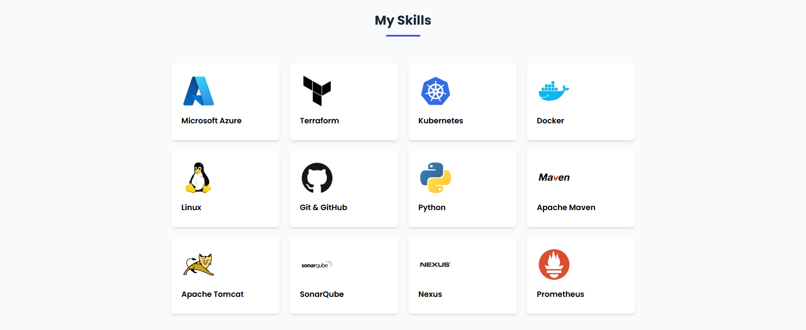

# my-Portfolio

🧑‍💻 Project: Personal Portfolio Website
Tech Stack: HTML, CSS (optional enhancements), basic JavaScript (if used)
Overview:
Designed and developed a responsive personal portfolio website using 100% HTML. The site showcases key sections including Home, About Me, Skills, Contact, and Projects.
Key Features:
- 💡 Structured Layout: Clearly defined sections for easy navigation.
- 📂 Clickable Resume: Integrated resume download feature using an anchor tag linking to a PDF file.
- 🚀 Project Gallery: Highlighted personal and academic projects with short descriptions and clickable links.
- 📬 Contact Section: Included email and social media links for seamless communication.
- 🎯 Minimalist Design: Focused on performance, clean structure, and accessibility without using external frameworks.

